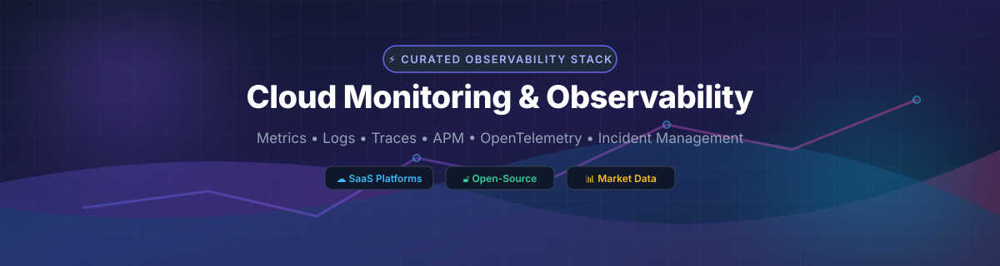

# ☁️ Awesome Cloud Monitoring & Observability 📊

  

  
  
  
  
  

---

> ⚡ **A curated list of enterprise SaaS platforms and open-source GitHub projects for Cloud Monitoring, Observability, Metrics, Logging, Distributed Tracing, APM & Incident Management.**
>
> 📅 **Last updated: October 2026**

This repository tracks top **SaaS platforms** and **open-source projects** for **Cloud Monitoring & Observability**. These solutions enable SREs, DevOps engineers, and platform teams to collect system metrics, aggregate application logs, trace distributed microservice requests, and orchestrate incident responses across cloud-native infrastructure.

---

## 📖 Table of Contents

- [☁️ SaaS & Hosted Platforms](#️-saas--hosted-platforms)
- [🔓 Open-Source GitHub Projects](#-open-source-github-projects)
- [🤝 How to Contribute](#-how-to-contribute)
- [💖 Support & Feedback](#-support--feedback)
- [📈 Star History](#-star-history)
- [⚠️ Disclaimer](#%EF%B8%8F-disclaimer)

---

## ☁️ SaaS & Hosted Platforms

> 📊 **Market Context**: The global cloud monitoring and observability market is estimated at **~$45 Billion in 2026**, growing toward **~$110 Billion by 2032** at a **~16% CAGR**. The sector is **moderately concentrated** with leading enterprises maintaining multi-vendor stacks rather than a single winner-take-all solution.

Below is a detailed comparison of top commercial observability platforms sorted by **Company Size / Revenue (Descending)**:

| Platform | Description | Pricing (Starting Tier) | Free Tier Limits | Company Size / Revenue |
| :--- | :--- | :--- | :--- | :--- |
| **[Azure Monitor](https://azure.microsoft.com/en-us/products/monitor/)** | Microsoft's comprehensive cloud monitoring suite covering Log Analytics, Application Insights, and automated alerts for Azure and hybrid workloads. | **$2.30/GB** ingested (Pay-As-You-Go Log Analytics); **$0.10/GB** for Basic Logs ingestion. | **$200 free credit** (30 days) + **5 GB/month free** log data ingestion forever. | **~$281 Billion** (Microsoft FY2025 Revenue) |
| **[AppDynamics](https://www.appdynamics.com/)** | Enterprise application performance monitoring (APM) and full-stack observability solution inside Cisco's software portfolio. | **$6/month per CPU core** (Infrastructure Monitoring Edition) or **$60/month per CPU core** (APM Edition). | **15-day free trial** with full platform capabilities; no perpetual free tier. | **~$538 Billion** (Cisco Market Cap / ~$54B Revenue) |
| **[Splunk Infrastructure Monitoring](https://www.splunk.com/)** | Real-time hybrid cloud observability and log analytics powered by Splunk AI Assistant and streaming architecture. | **$15/host/month** (Infrastructure Monitoring) or **$0.05/GB** (Observability Cloud ingestion). | **14-day free trial** with full access to self-service telemetry features; no perpetual free tier. | **~$28 Billion** (Acquired by Cisco for $28B / ~$3.8B Revenue) |
| **[Datadog](https://www.datadoghq.com/)** | Cloud-native observability platform providing unified APM, infrastructure metrics, log management, and network monitoring. | **$15/host/month** (Pro Infrastructure) or **$31/host/month** (APM & Continuous Profiling). | **14-day free trial** with full feature access; no perpetual free tier. | **~$2.5 Billion** (FY2025 Revenue) |
| **[Dynatrace](https://www.dynatrace.com/)** | AI-powered (Davis AI) observability platform featuring automated root-cause analysis and Smartscape topology mapping. | **$0.04/hour per host** (~$29/month host rate-card) for Full-Stack Monitoring; **$0.01/memory-GiB-hour** for Infrastructure. | **15-day free trial** with 1,000 credit units; no perpetual free tier. | **~$2.018 Billion** (FY2026 Revenue) |
| **[New Relic](https://newrelic.com/)** | Telemetry Data Platform with NRQL querying, error tracking, and full-stack telemetry visualization. | **$99/user/month** (Standard edition) + **$0.30/GB** data ingestion beyond free quota. | **100 GB/month free data ingest forever**, **1 full-platform user free**, unlimited basic users. | **~$733.8 Million** (Annual Revenue) |
| **[LogicMonitor](https://www.logicmonitor.com/)** | Automated enterprise hybrid infrastructure monitoring with agentless auto-discovery and CMDB integration. | **$22/device/month** (Pro tier) or **$32/device/month** (Enterprise tier). | **14-day free trial** with full platform features; no perpetual free tier. | **~$300+ Million** (Estimated Revenue) |
| **[Sumo Logic](https://www.sumologic.com/)** | SaaS log analytics, SIEM, and cloud infrastructure monitoring with flexible credit usage models. | **$3.00/GB** ingested (Log Analytics Essentials) or **$3.14/TB scanned** under Flex Pricing. | **30-day free trial** (1 GB/day data limit); no perpetual free tier. | **~$300+ Million** (Estimated Revenue) |
| **[Site24x7](https://www.site24x7.com/)** | All-in-one cloud infrastructure, website uptime, synthetic end-user monitoring, and APM. | **$9/month** (Starter tier billed annually, covers 10 servers/websites). | **Free-Forever plan**: 5 website / server monitors with 30-minute interval checks. | **Part of Zoho Corp** (~$1 Billion+ Revenue) |

---

## 🔓 Open-Source GitHub Projects

The open-source observability ecosystem is exceptionally mature, anchored by **Prometheus** for metrics collection, **Grafana** for dashboards, and **OpenTelemetry** for unified instrumentation standards.

The table below lists top open-source projects sorted by **GitHub Stars (Descending)**. Each star badge links directly to the stargazers page of that repository:

| Repo | Description | License | Stars |
| :--- | :--- | :--- | :--- |
| **[Netdata](https://github.com/netdata/netdata)** | Real-time infrastructure monitoring with zero configuration. Provides per-second metrics, auto-detection, interactive dashboards, and minimal footprint. | GPL-3.0 |  |
| **[Grafana](https://github.com/grafana/grafana)** | The leading open visualization and dashboarding platform. Connects seamlessly to Prometheus, Loki, Tempo, OpenSearch, and 100+ data sources. | AGPL-3.0 |  |
| **[Prometheus](https://github.com/prometheus/prometheus)** | The CNCF de facto standard pull-based time-series database and monitoring system with the PromQL query language. | Apache-2.0 |  |
| **[SigNoz](https://github.com/SigNoz/signoz)** | Native OpenTelemetry APM and observability platform serving as an open-source Datadog / New Relic alternative powered by ClickHouse. | MIT |  |
| **[Loki](https://github.com/grafana/loki)** | High-efficiency log aggregation system inspired by Prometheus. Indexes metadata labels instead of raw log text for low storage costs. | AGPL-3.0 |  |
| **[Jaeger](https://github.com/jaegertracing/jaeger)** | CNCF graduated end-to-end distributed tracing system for transaction monitoring, dependency analysis, and root-cause investigation. | Apache-2.0 |  |
| **[Zipkin](https://github.com/openzipkin/zipkin)** | Lightweight Java-based distributed tracing system originally built by Twitter for gathering timing telemetry. | Apache-2.0 |  |
| **[OpenSearch](https://github.com/opensearch-project/OpenSearch)** | Community-driven, open-source search and analytics suite derived from Elasticsearch for large-scale log analysis. | Apache-2.0 |  |
| **[HyperDX](https://github.com/hyperdxio/hyperdx)** | Developer-friendly open-source observability platform integrating logs, traces, metrics, and session replay into a single UI. | MIT |  |
| **[OneUptime](https://github.com/OneUptime/oneuptime)** | Complete open-source observability and uptime suite including status pages, incident handling, on-call alerts, and APM. | Apache-2.0 |  |
| **[OpenTelemetry Collector](https://github.com/open-telemetry/opentelemetry-collector)** | Vendor-neutral proxy and receiver component that receives, processes, and exports telemetry data across cloud backends. | Apache-2.0 |  |
| **[Zabbix](https://github.com/zabbix/zabbix)** | Enterprise-class open-source distributed monitoring platform for network servers, virtual machines, and cloud services. | AGPL-3.0 |  |
| **[Tempo](https://github.com/grafana/tempo)** | High-scale, easy-to-use distributed tracing backend built by Grafana Labs requiring only object storage. | AGPL-3.0 |  |
| **[Uptrace](https://github.com/uptrace/uptrace)** | OpenTelemetry-native APM tool powered by ClickHouse that monitors traces, metrics, and logs with automated alerting. | Apache-2.0 |  |
| **[Checkmk](https://github.com/Checkmk/checkmk)** | Infrastructure and application monitoring solution built for high performance with rule-based auto-configuration. | GPL-2.0 |  |

---

## 🤝 How to Contribute

Contributions are welcome! Please follow these steps to add or update entries:

1. Fork this repository.
2. Edit `README.md` following the table formatting rules.
3. Ensure description, pricing/stars details, and valid Markdown links are provided.
4. Open a Pull Request with a short explanation of your changes.

Check out [Awesome-Awesome-Awesome](https://github.com/ishandutta2007/Awesome-Awesome-Awesome) for more curated lists!

---

## 💖 Support & Feedback

Thank you for visiting and using **Awesome Cloud Monitoring & Observability**! 🚀

If you find this list helpful, please consider:
- ⭐ **Starring** this repository to help others discover it.
- 🔀 **Forking** it to customize or submit improvements.
- 📢 **Sharing** it with SRE, DevOps, and cloud engineering colleagues!

☕ **Buy Me a Coffee**: If you'd like to support the maintenance of this repository, you can sponsor the project directly on [GitHub Sponsors](https://github.com/sponsors/ishandutta2007).

---

## 📈 Star History

---

## ⚠️ Disclaimer

- This is a **community-curated** list — not exhaustive and not an official vendor endorsement.
- Observability platforms process sensitive system and telemetry data; ensure compliance with internal security policies and regulatory frameworks (GDPR, SOC2, HIPAA).
- Pricing figures and free tier quotas are verified against vendor documentation as of 2026 and are subject to change.
